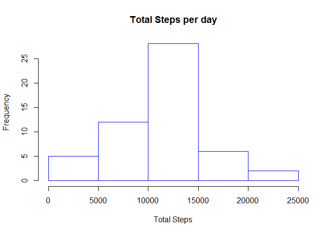
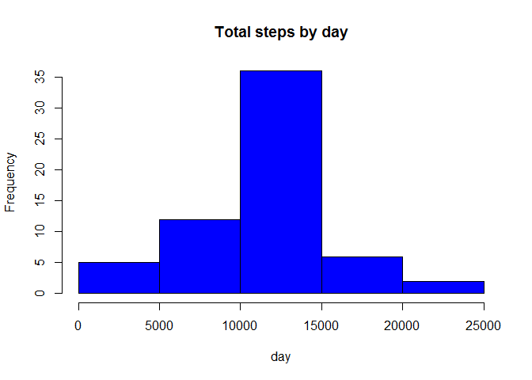
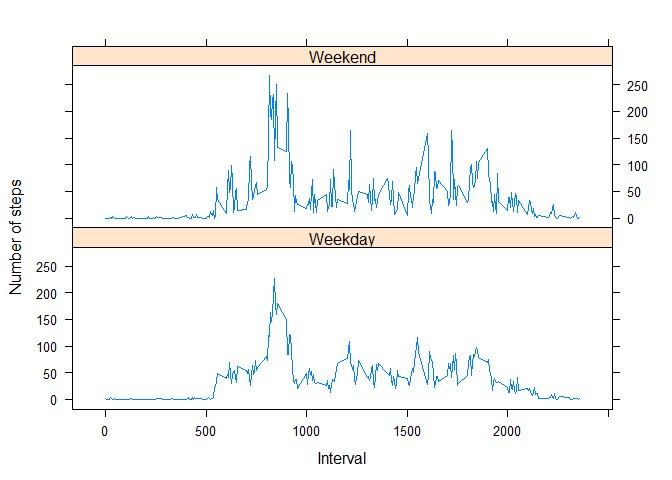

# Reproducible Research: Peer Assessment 1
Gautam Ganguly  
April 17, 2016  


#Loading and preprocessing the data

```r
## Download activity.zip from repo to you work directory
setwd("C:/GG/apps/RStudio-Workspace/jhu/Course5/Week/1")
# load data into workspace
activity <- read.csv2("activity.csv", header = TRUE, sep = ",", stringsAsFactors=F, colClasses = c("integer","character","integer"),  nrows = 17568)

require(lubridate)
```

```
## Loading required package: lubridate
```

```
## Warning: package 'lubridate' was built under R version 3.2.4
```

```r
#convert date column from character to date type
activity$date <- ymd(activity$date)
```

## What is mean total number of steps taken per day?

```r
totalStepsPerDay<- aggregate(steps ~ date, data = activity, sum, na.rm = TRUE)

# Make a histogram of the total number of steps taken each day
hist(totalStepsPerDay$steps, main="Total Steps per day", xlab="Total Steps", border="blue")
```



```r
#mean
mean(totalStepsPerDay$steps)
```

```
## [1] 10766.19
```

```r
#median
median(totalStepsPerDay$steps)
```

```
## [1] 10765
```

## What is the average daily activity pattern?

```r
#  average number of steps taken, averaged across all days
avgStepsByIntervalsPerDay	<- tapply(activity$steps, activity$interval, mean, na.rm = TRUE)

#   Make a time series plot (i.e. type = "l") of the 5-minute interval (x-axis) and the average number of steps taken, averaged across all days (y-axis)
plot(row.names(avgStepsByIntervalsPerDay), avgStepsByIntervalsPerDay, type = "l", xlab = "5-min interval", ylab = "Average across all Days", main = "Average number of steps taken",col = "blue")
```


```r
#Which 5-minute interval, on average across all the days in the dataset, contains the maximum number of steps?
maxStepInterval <- which.max(avgStepsByIntervalsPerDay)
names(maxStepInterval)
```

```
## [1] "835"
```


##Imputing missing values


```r
# Devise a strategy for filling in all of the missing values in the dataset. The strategy does not need to be sophisticated. 
# For example, you could use themean/median for that day, or the mean for that 5-minute interval,etc. Na replaced by mean in 5 min interval
impute.mean <- function(x) replace(x, is.na(x), mean(x, na.rm = TRUE))
require(dplyr)
```

```
## Loading required package: dplyr
```

```
## 
## Attaching package: 'dplyr'
```

```
## The following objects are masked from 'package:lubridate':
## 
##     intersect, setdiff, union
```

```
## The following objects are masked from 'package:stats':
## 
##     filter, lag
```

```
## The following objects are masked from 'package:base':
## 
##     intersect, setdiff, setequal, union
```

```r
activityNew <- activity %>%
    group_by(interval) %>%
    mutate(
        steps = impute.mean(steps)
    )

totalStepsPerDayNew <- aggregate(steps ~ date, data = activityNew, sum)

#The Histogram is
hist(totalStepsPerDayNew$steps, main = "Total steps by day", xlab = "day", col = "blue")
```



```r
# And the mean is
mean(totalStepsPerDayNew$steps)
```

```
## [1] 10766.19
```

```r
#median is
mean(totalStepsPerDayNew$steps)
```

```
## [1] 10766.19
```


## Are there differences in activity patterns between weekdays and weekends? 


```r
# For this part the weekdays() function may be of some help here. Use the dataset with the filled-in missing values for this part.
# Create a new factor variable in the dataset with two levels - "weekday" and "weekend" indicating whether a given date is a weekday or weekend day.
activityNew$day  <- ifelse(grepl("(Sat)|(Sun)", weekdays(unique(activityNew$date), abbreviate=TRUE)), "Weekend", "Weekday")

#convert day type to factor
activityNew$day <- factor(activityNew$day)

# Make a panel plot containing a time series plot (i.e. type = "l") of the 5-minute interval (x-axis) and the average number of steps taken, averaged across # # all weekday days or weekend days (y-axis). 
avgStepsByDay	<- tapply(activityNew$steps, activityNew$day, mean)
avgStepsByDay <- aggregate(steps ~ interval + day, data = activityNew, mean)

require(lattice)
```

```
## Loading required package: lattice
```

```r
xyplot(steps ~ interval | day, avgStepsByDay, type = "l", layout = c(1, 2), xlab = "Interval", ylab = "Number of steps")
```


